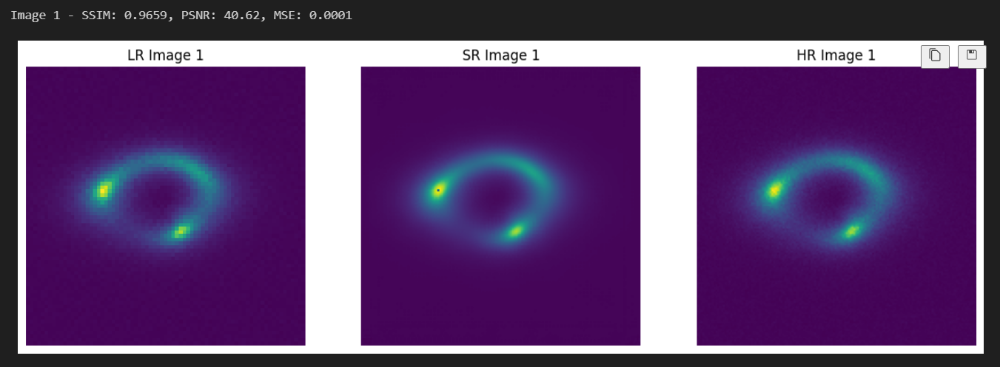

# SRGAN for Gravitational Lens Image Super-Resolution

[](LICENSE)
[](https://www.python.org/downloads/)
[](https://pytorch.org/)

This repository contains an implementation of the Super-Resolution Generative Adversarial Network (SRGAN) for enhancing the resolution of gravitational lens images. The model is trained on simulated gravitational lens images and then fine-tuned using transfer learning to super-resolve real gravitational lens images.

## Table of Contents

- [Overview](#overview)
- [Model Architecture](#model-architecture)
  - [Generator](#generator)
  - [Discriminator](#discriminator)
- [Installation](#installation)
- [Usage](#usage)
- [Results](#results)
- [Contributing](#contributing)
- [License](#license)
- [Acknowledgments](#acknowledgments)

## Overview

The SRGAN architecture consists of a generator and a discriminator network. The generator takes a low-resolution image as input and generates a high-resolution version of the image. The discriminator is trained to distinguish between real high-resolution images and generated high-resolution images. The generator and discriminator are trained adversarially, resulting in the generator producing realistic high-resolution images.

## Model Architecture

### Generator

The generator network is composed of the following components:

- Initial convolutional block
- Residual blocks
- Convolutional block
- Upsampling block
- Final convolutional layer

The generator takes a low-resolution image as input and progressively upscales it to produce a high-resolution output.

### Discriminator

The discriminator network consists of a series of convolutional blocks followed by a classification head. The convolutional blocks extract features from the input image, and the classification head predicts whether the input is a real high-resolution image or a generated one.

## Installation

1. Clone the repository:

   ```shell
   git clone https://github.com/yourusername/srgan-gravitational-lensing.git
   cd srgan-gravitational-lensing
   ```

2. Install the required dependencies:

   ```shell
   pip install -r requirements.txt
   ```

## Usage

1. Prepare a dataset of low-resolution and high-resolution gravitational lens images.

2. Train the SRGAN model on the simulated gravitational lens images:

   ```shell
   python train.py --data_dir path/to/simulated/data --output_dir path/to/output
   ```

3. Fine-tune the model on real gravitational lens images using transfer learning:

   ```shell
   python finetune.py --data_dir path/to/real/data --pretrained_model path/to/pretrained/model --output_dir path/to/output
   ```

4. Use the trained model to super-resolve new gravitational lens images:

   ```shell
   python super_resolve.py --input_image path/to/input/image --output_image path/to/output/image --model_path path/to/trained/model
   ```

## Results

The SRGAN model achieves significant improvement in the resolution and clarity of gravitational lens images. The generated high-resolution images exhibit enhanced details and structures compared to the original low-resolution images.

### Simulated Data

Here are some example results of the SRGAN model on simulated gravitational lens images:




### Real Data

Here are some example results of the SRGAN model with transfer learning on real gravitational lens images:

 


The SRGAN model achieves significant improvement in the resolution and clarity of gravitational lens images. The generated high-resolution images exhibit enhanced details and structures compared to the original low-resolution images.


## Citation

If you use this code or find it helpful for your research, please cite the original SRGAN paper:

```bibtex
@inproceedings{ledig2017photo,
  title={Photo-Realistic Single Image Super-Resolution Using a Generative Adversarial Network},
  author={Ledig, Christian and Theis, Lucas and Huszar, Ferenc and Caballero, Jose and Cunningham, Andrew and Acosta, Alejandro and Aitken, Andrew and Tejani, Alykhan and Totz, Johannes and Wang, Zehan and others},
  booktitle={Proceedings of the IEEE Conference on Computer Vision and Pattern Recognition},
  pages={4681--4690},
  year={2017}
}
```
